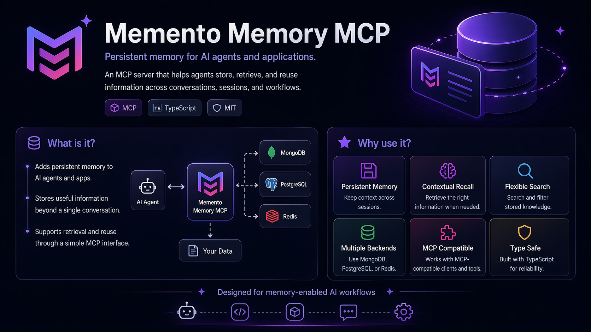
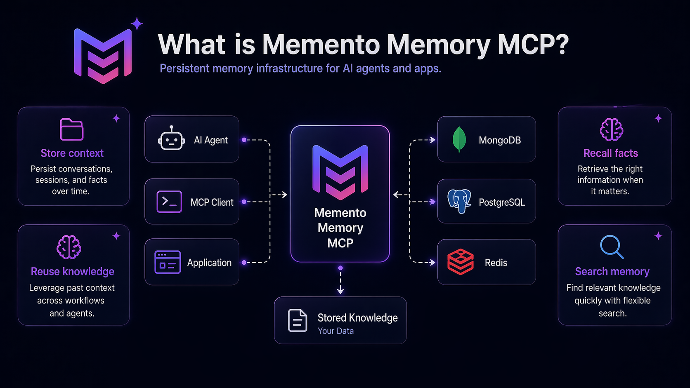
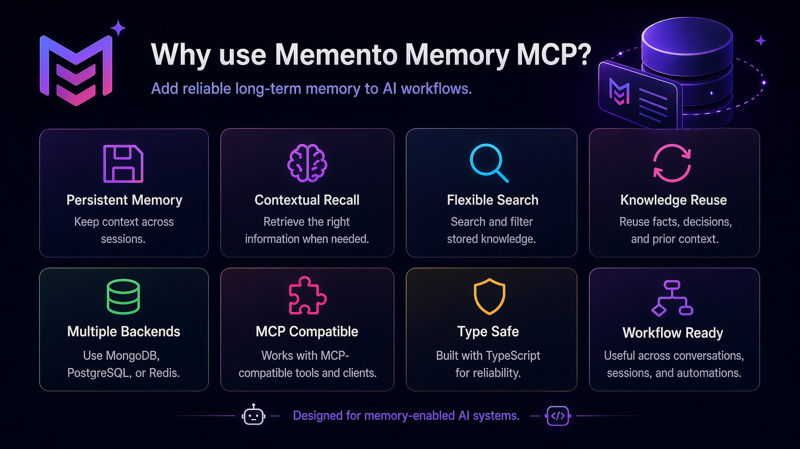

<div align="center">



<br />

# memento-mcp

### Persistent memory for AI coding agents.

A local-first MCP server that gives **Claude Code**, **Codex**, **Cursor**, and any stdio-MCP client durable project memory: facts, decisions, patterns, architecture notes, pitfalls, session summaries, and team-shared knowledge — while cutting **thousands of tokens of repeated context** out of every single session.

<br />

[](https://www.npmjs.com/package/@luispmonteiro/memento-memory-mcp)
[](https://github.com/lfrmonteiro99/memento-mcp/actions/workflows/tests.yml)
[](#testing)
[](https://nodejs.org/)
[](LICENSE)
[](https://modelcontextprotocol.io)
[](#stay-local-by-default)

</div>

---

> [!NOTE]
> AI coding agents are powerful, but they forget. They forget why a decision was made, which migration broke production, which convention your project follows, and which workaround saved you three hours last week.
>
> **`memento-mcp` fixes that — and stops your agent burning thousands of tokens re-reading the same context every session.**

It stores structured memories locally in SQLite, retrieves the right context when your agent needs it, and can sync selected team memories through git. No hosted vector database. No mandatory cloud account. No mystery SaaS quietly eating your project history.

<br />

## Quick start

```bash
npm install -g @luispmonteiro/memento-memory-mcp
memento-mcp install
memento-mcp import auto       # detects CLAUDE.md, AGENTS.md, .cursor/rules, .github/copilot-instructions, …
memento-mcp ui
```

---

## Table of contents

- [Documentation](#documentation)
- [Requirements](#requirements)
- [Package](#package)
- [What it does](#what-it-does)
- [Why use it](#why-use-it)
- [Installation](#installation)
- [60-second tour](#60-second-tour)
- [Core features](#core-features)
- [Knowledge model](#knowledge-model)
- [Example use cases](#example-use-cases)
- [Testing](#testing)
- [License](#license)

---

## Documentation

<table>
<tr>
<td valign="top" width="33%">

**Getting started**

- [Installation & client setup](docs/install.md)
- [Importing existing project memory](docs/import.md) — CLAUDE.md, AGENTS.md, Cursor, Copilot, Gemini, Windsurf, Cline, Roo

</td>
<td valign="top" width="33%">

**Features**

- [Team-scoped memories with git sync](docs/team-sync.md)
- [Per-project policy](docs/policy.md)
- [Optional embeddings](docs/embeddings.md)
- [End-of-session summaries](docs/session-summaries.md)
- [Privacy](docs/privacy.md)
- [Token-aware search](docs/search.md)
- [Mode profiles](docs/mode-profiles.md)
- [Vault integration](docs/vault.md)
- [Web inspector](docs/web-inspector.md)

</td>
<td valign="top" width="33%">

**Reference**

- [Configuration](docs/configuration.md)
- [MCP tools reference](docs/mcp-tools.md)
- [Development & troubleshooting](docs/development.md)

</td>
</tr>
</table>

---

## Requirements

- **Node.js 20** or newer (20.x, 22.x, 24.x — Node 18 is EOL and no longer supported)
- **npm**
- An **MCP-compatible client**, such as Claude Code, Codex, Cursor, or another stdio-MCP client

<details>
<summary><b>Optional dependencies</b></summary>

- Obsidian vault for curated Markdown knowledge
- OpenAI key for semantic embeddings
- Anthropic or OpenAI key for LLM-assisted session summaries
- git repo for team memory sync

</details>

---

## Package

Published on npm as:

```text
@luispmonteiro/memento-memory-mcp
```

Install globally:

```bash
npm install -g @luispmonteiro/memento-memory-mcp
```

---

## What it does

`memento-mcp` gives your AI coding tools a memory layer that survives across sessions, machines, and teammates.

It can remember:

| | |
| :--- | :--- |
| Architectural decisions | Project conventions |
| Known pitfalls | Implementation patterns |
| Debugging notes | User/team preferences |
| Session summaries | Reusable context from `CLAUDE.md`, `AGENTS.md`, Cursor rules, Copilot instructions, … |
| Curated notes from an Obsidian vault | |

Then it injects the relevant context back into your agent at the right time, without forcing you to paste the same project explanation into every new chat like a medieval scribe with npm installed.

---

## Why use it

### Save tokens. A lot of them.

Without persistent memory, every new session starts blind:

- `CLAUDE.md` / `AGENTS.md` / `.cursor/rules/` / Copilot instructions get re-pasted or stuffed into the system prompt
- Architectural decisions are re-explained mid-conversation
- Last week's pitfall is re-discovered the hard way
- "What were we doing yesterday?" eats hundreds of tokens before any actual work happens

`memento-mcp` imports that context **once** — from any of the major LLM instruction files — and serves back only the slice the current prompt needs, using [progressive disclosure](docs/search.md) that prefers cheap index/summary layers over full bodies.

```bash
memento-mcp import auto       # detects every known LLM memory file in the project
```

#### Conservative per-session savings

| Where the tokens go | Without memento | With memento | Saved |
| :--- | ---: | ---: | ---: |
| `CLAUDE.md` / `AGENTS.md` / `.cursorrules` re-injected | ~1,500 t | imported once → 0 t | **~1,500 t** |
| Architecture re-explained mid-chat | ~500 t | 1 retrieved decision (~80 t) | **~420 t** |
| Pitfall re-discovered | ~300 t | 1 retrieved pitfall (~80 t) | **~220 t** |
| "What were we doing?" recap | ~400 t | 1 session summary (~200 t) | **~200 t** |
| **Total prelude per session** | **~2,700 t** | **~360 t** | **~2,340 t** |

> [!NOTE]
> Numbers are deliberately conservative. Real-world `CLAUDE.md` / `AGENTS.md` / `.cursor/rules/` trees routinely reach 3-5k tokens (often more once a team accumulates files across multiple tools), and longer-running projects accumulate dozens of decisions and pitfalls. Savings scale with project age.

#### Scaled out

| Cadence | Sessions / month | Tokens saved (conservative) |
| :--- | ---: | ---: |
| Solo dev, ~4 sessions/day | ~80 | **~190,000** |
| 5-person team, same cadence | ~400 | **~940,000** |

Three things you get back, for free:

1. **Latency** — the agent stops chewing through thousands of prelude tokens before responding.
2. **Context budget** — that ~2,300 tokens of saved prelude is ~2,300 tokens you can spend on actual code, longer files, or richer reasoning.
3. **Cost** — every saved token is one you don't pay for, on every session, on every machine, on every teammate.

> [!TIP]
> Compounding effect: when embeddings are enabled, [write-time dedup](docs/embeddings.md#smart-write-time-dedup) keeps the memory store lean, and [adaptive ranking](docs/search.md) surfaces only high-utility memories — so the *retrieved* tokens are higher-signal too.

### Keep decisions close to the code

Log decisions, pitfalls, patterns, and architecture notes as structured memories instead of burying them in old chats, random Markdown files, or the cursed archaeology layer known as “Slack search”.

### Share memory with your team

Team-scoped memories are serialized into your repo under:

```text
.memento/memories/
```

Commit them, push them, and teammates can pull the same operational knowledge.

```bash
memento-mcp sync init
memento-mcp sync pull
```

### Stay local by default

The default setup uses:

- local SQLite
- SQLite FTS5 search
- local config
- local web inspector
- no required cloud account
- no hosted database

> [!TIP]
> Optional embeddings are available, but they are **opt-in**.

### Keep private text private

`<private>...</private>` regions are excluded from search indexes, injection, embeddings, LLM calls, and sync paths. Secret scrubbing is applied at write time for common credentials such as env-var values, JWTs, GitHub tokens, URL credentials, and authorization headers.

### See and control what the agent knows

Run the local inspector:

```bash
memento-mcp ui
```

Browse memories, sessions, projects, sync state, analytics, and drift without opening yet another SaaS dashboard pretending to be “simple”.

---

## Installation

**1.** Install from npm:

```bash
npm install -g @luispmonteiro/memento-memory-mcp
```

**2.** Wire it into your MCP client:

```bash
memento-mcp install
```

This configures supported local clients such as Claude Code, Codex, Cursor, or other stdio-MCP clients.

**3.** Verify the install:

```bash
memento-mcp --help
```

**4.** Open the local web UI:

```bash
memento-mcp ui
```

---

## 60-second tour

```bash
# 1. Install from npm
npm install -g @luispmonteiro/memento-memory-mcp

# 2. Wire your MCP client
memento-mcp install

# 3. Import existing project memory (CLAUDE.md, AGENTS.md, .cursor/rules, copilot-instructions, …)
memento-mcp import auto --dry-run
memento-mcp import auto --no-confirm

# 4. Open the local inspector
memento-mcp ui

# 5. Share team memory through git
memento-mcp sync init
memento-mcp sync pull
```

---

## Core features

### Typed memories

Store different kinds of project knowledge with different ranking weights and retrieval behavior:

`fact` &nbsp;·&nbsp; `decision` &nbsp;·&nbsp; `preference` &nbsp;·&nbsp; `pattern` &nbsp;·&nbsp; `architecture` &nbsp;·&nbsp; `pitfall`

Dedicated tools such as `decisions_log` and `pitfalls_log` make high-signal memory capture easier.

> Read more: [MCP tools reference](docs/mcp-tools.md)

### Team memory via git

Team-scoped memories are written as JSON files under:

```text
.memento/memories/<id>.json
```

That means your team can review, commit, diff, and sync shared agent memory like normal project files.

> Read more: [Team-scoped memories with git sync](docs/team-sync.md)

### Per-project policy

Use `.memento/policy.toml` to control project-specific behavior:

- required tags
- banned content patterns
- retention rules
- vault promotion rules
- memory constraints

The policy lives in the repo, not hidden somewhere on one developer’s machine, because apparently “works on my machine” needed a memory layer too.

> Read more: [Per-project policy](docs/policy.md)

### Local-first search

By default, `memento-mcp` uses:

- SQLite
- FTS5
- typed scoring
- token-aware result ranking
- adaptive utility feedback

No vector database is required.

> Read more: [Token-aware search](docs/search.md)

### Optional semantic search

If you want semantic retrieval, enable embeddings. FTS5 and vector results are merged through an adaptive ranker.

Embeddings are opt-in and use your own provider key.

> Read more: [Optional embeddings](docs/embeddings.md)

### Smart write-time deduplication

When embeddings are enabled, near-duplicate memories can be detected at write time, before your memory store becomes a landfill of almost-identical “important notes”.

> Read more: [Smart write-time dedup](docs/embeddings.md#smart-write-time-dedup)

### Session summaries

Capture useful session context at the end of a coding session.

Supported modes:

- deterministic summaries by default
- optional LLM-assisted summaries using Anthropic or OpenAI

> Read more: [End-of-session summaries](docs/session-summaries.md)

### Obsidian vault integration

Index a curated Obsidian vault and route context through:

`me.md` &nbsp;·&nbsp; `vault.md` &nbsp;·&nbsp; maps &nbsp;·&nbsp; skills &nbsp;·&nbsp; playbooks &nbsp;·&nbsp; long-form project notes

The vault layer is indexed and searched, but not auto-written by the agent unless explicitly promoted.

> Read more: [Vault integration](docs/vault.md)

### Privacy controls

Privacy features include:

- `<private>...</private>` redaction
- FTS exclusion for private regions
- embedding exclusion for private regions
- sync exclusion for private content
- secret scrubbing at write time
- title and body sanitization

> Read more: [Privacy](docs/privacy.md)

### Mode profiles

Switch stop-words and trivial-prompt classifiers by profile:

- English
- Portuguese
- Spanish

Use config or environment variables:

```bash
MEMENTO_PROFILE=portuguese
```

> Read more: [Mode profiles](docs/mode-profiles.md)

### Automatic context injection and capture

Memory tools (`memory_store`, `memory_search`, `decisions_log`, …) work in any stdio-MCP client. Automatic injection and capture use whatever extension mechanism the client provides — most major clients now expose lifecycle hooks.

<details open>
<summary><b>Client compatibility</b></summary>

<br />

| Client | MCP tools | Hooks | Hooks since |
| :--- | :---: | :---: | :--- |
| **Claude Code** | yes | yes (native) | shipped with Claude Code |
| **Cursor** | yes | yes (native) | 1.7 (Oct 2025) |
| **Codex** | yes | yes (native, opt-in flag) | 0.114.0 (Mar 2026) |
| **Gemini CLI** | yes | yes (native) | 0.26.0 (Jan 2026) |
| **Cline** | yes | yes (native) | 3.36.0 (late 2025) |
| **Aider** | yes | no — rule-file fallback only | — |
| Other stdio-MCP | yes | depends on client | — |

</details>

Each client's hook event names and config format differ (e.g. Claude Code uses `UserPromptSubmit`, Cursor uses `beforeSubmitPrompt`, Cline filenames the events). The four `memento-hook-*` binaries were built for Claude Code's stdin payload shape; they work directly on Codex (very similar payload), and may need a light adapter on Cursor, Gemini CLI, and Cline. For clients without hooks, fall back to a rule file (`AGENTS.md`, `.cursor/rules/*.mdc`, system prompt) telling the agent to call the memory tools itself.

> Read more: [Installation & client setup](docs/install.md)

### Web inspector

Launch a local browser UI:

```bash
memento-mcp ui
```

Inspect:

`memories` &nbsp;·&nbsp; `sessions` &nbsp;·&nbsp; `projects` &nbsp;·&nbsp; `sync drift` &nbsp;·&nbsp; `analytics` &nbsp;·&nbsp; `memory health`

> Read more: [Web inspector](docs/web-inspector.md)

---

## Knowledge model

`memento-mcp` separates fast operational memory from curated long-form knowledge.

<table>
<tr>
<td valign="top" width="50%">

### SQLite memory layer

Fast, typed, agent-written memory.

Use it for:

- decisions
- facts
- patterns
- bugs
- pitfalls
- preferences
- session-derived notes

</td>
<td valign="top" width="50%">

### Vault knowledge layer

Curated Markdown knowledge from an Obsidian vault.

Use it for:

- long-form docs
- project maps
- personal/team playbooks
- technical notes
- stable reference material

</td>
</tr>
</table>

Search and hooks can combine both layers.

<div align="center">



<br /><br />



</div>

---

## Example use cases

### Remember project decisions

> **Decision:** We use repository classes for complex SQL access instead of putting queries in controllers.
>
> **Reason:** Keeps business logic separate from persistence and makes performance tuning easier.
>
> **Scope:** project &nbsp;·&nbsp; **Tags:** `architecture`, `backend`

### Remember pitfalls

> **Pitfall:** The quality scheduling query becomes expensive when paginating after loading all rows.
>
> **Fix:** Use database-level pagination and a separate count query.
>
> **Scope:** project &nbsp;·&nbsp; **Tags:** `performance`, `sql`

### Remember team conventions

> **Preference:** In this project, bug fixes and improvements are tracked separately in release notes.
>
> **Scope:** team &nbsp;·&nbsp; **Tags:** `process`, `release-notes`

---

## Testing

`memento-mcp` ships with **1,352 tests across 121 test files**, covering **91% of lines and 85% of branches**. The suite runs on Node 20, 22, and 24 in CI on every push and pull request.

### Run the tests

```bash
npm install
npm test                    # full suite, ~40s
npm run test:watch          # watch mode for development
npx vitest run --coverage   # generate the v8 coverage report
```

### What the suite covers

| Layer | What's tested |
|---|---|
| **MCP server** | Spawns the built server, performs an MCP handshake over stdio, asserts every registered tool is callable end-to-end (`tests/integration/mcp-server-smoke.test.ts`). |
| **Memory lifecycle** | Chained `store → search → get → update → link → graph → path → unlink → pin → timeline → delete → export → import` flow (`tests/integration/memory-lifecycle.test.ts`). |
| **Privacy** | Pins the `<private>...</private>` redaction promise across every public output (search, list, get, timeline, FTS, sync), and verifies `reveal_private` opt-in + analytics (`tests/integration/privacy-invariants.test.ts`). |
| **Vault** | Promotion → file write → re-index → vault search → `memory_get(vault:id)` round-trip (`tests/integration/vault-promotion-flow.test.ts`). |
| **Tools** | Per-tool unit tests for `memory_*`, `decisions_log`, `pitfalls_log`, plus dedup, policy, and analytics paths (`tests/tools/`). |
| **Hooks** | `SessionStart`, `UserPromptSubmit`, `PostToolUse`, `SessionEnd` hook handlers (`tests/hooks/`). |
| **Database** | Repos, migrations, FTS triggers, edges, sessions (`tests/db/`). |
| **Engine** | Classifier, compressor, adaptive ranker, embeddings, vault parser/router/index, similarity, token estimator (`tests/engine/`). |
| **Sync** | Canonical JSON serializer round-trips, push/pull, schema migration, secret scrubbing on the wire (`tests/sync/`). |
| **Web inspector** | Every API route, edit-mode auth, pagination, security headers (`tests/server/`). |
| **CLI** | Installer, uninstaller, all import formats (`tests/cli/`). |
| **Regression** | v1-behavior compatibility for legacy users (`tests/regression/`). |

### Coverage exclusions

Process entry points (`src/index.ts`, `src/cli/main.ts`, the hook bin scripts) are excluded from the coverage denominator: they are exercised by integration tests via `spawnSync`, but v8 cannot track child-process coverage. The handlers and helpers they invoke are fully covered. See `vitest.config.ts` for the full list.

---

## License

[MIT](LICENSE)

<div align="center">

<sub>Built with care for AI coding agents that deserve to remember.</sub>

</div>
